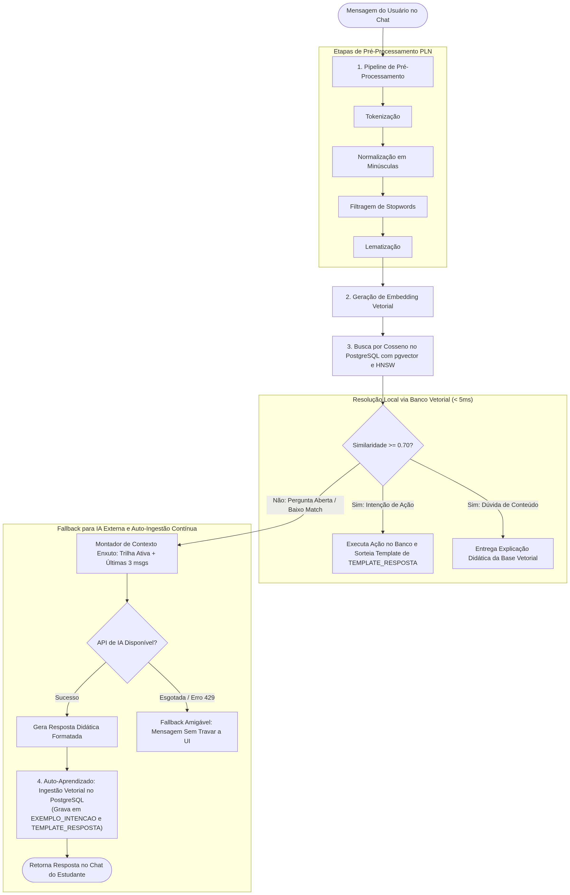

# VariSkill

<br>

<p align="center">
    <a href="#sobre"> Sobre o projeto</a> &nbsp;|&nbsp;&nbsp;
    <a href="#requisitos"> Requisitos funcionais</a> &nbsp;|&nbsp;&nbsp;
    <a href="#backlog"> Backlog do produto </a> &nbsp;|&nbsp;&nbsp;
    <a href="#entregas"> Entregas de sprints </a> &nbsp;|&nbsp;&nbsp;
    <a href="#tecnologias"> Tecnologias utilizadas </a> &nbsp;|&nbsp;&nbsp;  
    <a href="#estrutura"> Estrutura do projeto </a> &nbsp;|&nbsp;&nbsp;  
    <a href="#dor-dod"> DoR & DoD </a> &nbsp;|&nbsp;&nbsp;
    <a href="#links"> Links úteis </a> &nbsp;|&nbsp;&nbsp;
    <a href="#equipe"> Equipe </a>
</p>

---

<span id="sobre">

# 📑 Sobre o projeto

No contexto atual de capacitação e formação técnica corporativa, colaboradores frequentemente enfrentam trilhas de aprendizagem lineares e despersonalizadas, o que gera alto índice de evasão e baixa retenção do conhecimento prático. Identificar lacunas conceituais e oferecer acompanhamento pedagógico contínuo e motivador é um dos maiores desafios enfrentados por empresas de tecnologia.

Com isso, desenvolvemos o **VariSkill**. A aplicação recepciona o estudante por meio de um assistente virtual inteligente, aplicando, opcionalmente, um teste de nivelamento diagnóstico no acolhimento para posicioná-lo no ponto ideal da trilha de conhecimento.

A jornada pedagógica organiza-se em trilhas, divididas em módulos sequenciais com visualização de progresso e bloqueios. Cada módulo é composto por atividades que encapsulam conteúdos teóricos opcionais em Markdown e baterias de questões determinísticas (múltipla escolha, preenchimento de lacunas de código e ordenação de blocos). O aprendizado é apoiado por um motor híbrido de Processamento de Linguagem Natural (PLN) integrado ao banco vetorial PostgreSQL com extensão pgvector, fornecendo suporte e dicas conceituais contextualizadas sem entregar a resposta direta, além de um sistema completo de gamificação com experiência (XP), níveis, sequência diária de estudos (streaks), insígnias e recompensas.

<br>

---

<span id="requisitos">

# 📋 Requisitos funcionais

- **RFN01 - Cadastro e Perfil:** Cadastro e gerenciamento de dados básicos do usuário e preferências de estudo.
- **RFN02 - Onboarding e Diagnóstico Orientado:** O assistente conduz a sondagem inicial em linguagem natural para identificar se o usuário é iniciante ou se deseja validar um nível autodeclarado através de uma bateria prática na UI.
- **RFN03 - Matrícula e Direcionamento de Trilha:** O usuário pode consultar ou ser guiado pelo assistente para se matricular em uma trilha de aprendizagem correspondente ao seu nível.
- **RFN04 - Execução e Avaliação de Atividades:** A plataforma disponibiliza atividades estruturadas na UI (quiz, desafios) avaliadas por regras determinísticas (sem gasto de IA).
- **RFN05 - Visualização da Jornada e Progresso:** A UI exibe mapa de progresso, status dos módulos e histórico de atividades concluídas.
- **RFN06 - Suporte Contextual durante Atividade:** O assistente tira dúvidas e oferece dicas conceituais sobre a atividade em tela sem entregar a resposta direta.
- **RFN07 - Geração de Feedback e Acompanhamento:** O assistente fornece feedback em linguagem natural ao final de módulos/trilhas ou sob demanda do usuário sobre seu desempenho.
- **RFN08 - Sistema de Gamificação (XP, Níveis e Streaks):** A aplicação atribui XP por regras determinísticas, avanço de níveis por módulo e controle de sequência diária de estudo.
- **RFN09 - Conquistas e Recompensas:** O usuário desbloqueia insígnias/conquistas ao atingir marcos de estudo e desempenho.
- **RFN10 - Resiliência e Disponibilidade:** O sistema opera as funções de trilha, exercícios e gamificação mesmo com indisponibilidade ou esgotamento de cotas de IA/PLN externo.

<br>

---

<span id="backlog">

# 🎯 Backlog do produto

| RFN | Rank | Prioridade | User Story | Estimativa | Sprint | Critérios de Aceitação |
|-----|------|------------|------------|------------|--------|------------------------|
| RFN01 | 1 | Alta | Como usuário, quero me cadastrar e gerenciar meu perfil, para que minhas informações e preferências de estudo fiquem registradas. | 5 | 1 | - Formulário de cadastro com nome, e-mail e senha;<br>- E-mail único no sistema;<br>- Edição de perfil para alteração de nome e senha;<br>- Dados devidamente persistidos. |
| RFN02 | 2 | Alta | Como novo usuário, quero ser acolhido pelo assistente virtual no primeiro login, para que ele apresente as trilhas e entenda meu objetivo inicial. | 5 | 1 | - Apresentação amigável do assistente;<br>- Listagem das trilhas/cursos disponíveis via conversação;<br>- Identificação da trilha escolhida pelo usuário via diálogo. |
| RFN03 | 3 | Alta | Como usuário, quero definir com o assistente se farei um teste prático ou se começarei do início, para que minha trilha seja configurada no nível certo. | 5 | 1 | - Assistente questiona sobre conhecimento prévio;<br>- Se optar por começar do início, usuário é matriculado no nível básico com mensagem motivacional;<br>- Se declarar nível (ex: intermediário), assistente dispara a bateria de teste prático na UI. |
| RFN04 | 4 | Alta | Como usuário, quero acessar conteúdos conceituais e realizar atividades práticas, para que eu adquira a base teórica e valide meu aprendizado com testes de nível. | 8 | 1 | - Interface exibe o texto explicativo/teórico em Markdown com exemplos de código antes das atividades;<br>- Interface renderiza questões dos 3 formatos (múltipla escolha, complete o código e ordenar blocos);<br>- Registro das submissões do usuário com correção determinística;<br>- Se for teste de nível: validação da nota de corte para posicionar no nível de conhecimento correspondente e liberar os módulos no PROGRESSO_MODULO. |
| RFN06 | 5 | Alta | Como usuário em atividade, quero consultar o assistente virtual via chat, para que ele tire dúvidas conceituais sem dar a resposta direta. | 5 | 1 | - Acesso ao chat integrado na tela da atividade ativa;<br>- Assistente consulta primeiro a base local de dicas daquela atividade (DICA_CONCEITUAL);<br>- Fallback para IA externa com prompt contextualizado no enunciado caso não haja match local;<br>- Mensagem amigável caso a IA fique indisponível. |
| RFN05 | 6 | Alta | Como usuário, quero visualizar minha jornada de aprendizagem com as etapas e meu próximo objetivo, para que eu acompanhe onde estou e o que devo fazer. | 5 | 2 | - Mapa visual ou timeline com módulos, conteúdos teóricos e status (bloqueado, disponível, concluído);<br>- Indicação destacada da próxima atividade recomendada;<br>- Histórico com resultados das atividades finalizadas. |
| RFN08 | 7 | Alta | Como usuário, quero ganhar pontos de experiência (XP) e evoluir de nível nos módulos, para que eu me sinta motivado a continuar estudando. | 5 | 2 | - Atribuição determinística de XP ao concluir atividades e módulos;<br>- Barra de progresso visível na interface;<br>- Indicador visual do nível atual e notificação comemorativa ao subir de nível. |
| RFN07 | 8 | Média | Como usuário, quero receber feedback do assistente virtual ao concluir um módulo ou sob demanda, para que eu entenda meus acertos, dificuldades e próximos passos. | 5 | 2 | - Assistente analisa métricas do banco (percentual de acertos no módulo);<br>- Geração determinística de parecer formativo com templates dinâmicos calibrados pelo aproveitamento (positivo para >= 70% e atenção para < 70%);<br>- Mensagem incentivadora com recomendação dos próximos passos. |
| RFN02 | 9 | Alta | Como usuário, quero enviar comandos em linguagem natural no chat (ex: pedir próxima atividade, consultar nível e XP), para que o assistente execute a ação no sistema via PLN local sem consumir a IA externa. | 8 | 2 | - Pipeline de PLN local com classificação de intenções e ações sobre o corpus de intenções;<br>- Execução direta de ações no banco para comandos com similaridade >= 0.70 com templates variados de resposta;<br>- Encaminhamento para a IA externa apenas de mensagens não reconhecidas localmente. |
| RFN10 | 10 | Alta | Como usuário, quero que a plataforma permaneça rápida e disponível mesmo em momentos de instabilidade da IA, para que meus estudos e exercícios nunca sejam interrompidos. | 5 | 2 | - Payload otimizado com contexto enxuto (trilha ativa + resumo) para manter respostas ágeis;<br>- Tratamento resiliente de falhas de rede e esgotamento de cotas da API externa (HTTP 429) com mensagens amigáveis de contingência;<br>- Navegação, conteúdos, quizzes e ganho de XP 100% operacionais mesmo sem conexão com a IA. |
| RFN09 | 11 | Média | Como usuário, quero desbloquear conquistas, acumular recompensas no meu inventário e manter um streak diário, para que meu engajamento seja reconhecido e exibido no perfil. | 8 | 3 | - Registro diário de acesso/atividades com contador de streak no dashboard;<br>- Regras determinísticas para desbloqueio de cosméticos (avatares, medalhas e títulos) do catálogo de recompensas;<br>- Inventário do aluno registrando as conquistas e itens desbloqueados. |
| RFN06 | 12 | Média | Como estudante, quero que as dúvidas explicadas pelo assistente fiquem salvas na base de conhecimento, para que perguntas semelhantes sejam respondidas instantaneamente sem lentidão de rede. | 8 | 3 | - Ingestão assíncrona no banco de dados do par pergunta do aluno + resposta didática gerada pela IA vinculada ao módulo/atividade;<br>- Busca por similaridade local priorizando as dúvidas já assimiladas pelo sistema;<br>- Redução drástica de chamadas à IA externa e resposta imediata (< 100ms) para dúvidas recorrentes. |
| RFN07 | 13 | Baixa | Como estudante recorrente, quero que o assistente se lembre do meu histórico, pontos fortes e dificuldades anteriores, para que suas orientações e saudações sejam personalizadas à minha evolução. | 5 | 3 | - Atualização do contexto resumido na sessão de chat após fechamento de cada módulo com histórico de dificuldades e pontos fortes;<br>- Assistente utiliza a memória da sessão para calibrar saudações, recomendações e novos feedbacks ao longo do tempo. |

<br>

---

<span id="entregas">

# 🏁 Entregas de sprints

O desenvolvimento segue o cronograma acadêmico oficial da Fatec São José dos Campos (2026-2). Cada entrega de sprint é formalizada pela publicação de releases e tags nos repositórios, acompanhada do relatório técnico e evidências de validação.

| Sprint | Período oficial | Status | Histórico |
|:---:|:---:|:---|:---:|
| 01 | 07/09/2026 a 27/09/2026 | ✅ OK | [Ver relatório](https://github.com/SkyFlyTeam/VariSkill-documentantion/tree/sprint1) |
| 02 | 05/10/2026 a 25/10/2026 | A iniciar | - |
| 03 | 02/11/2026 a 22/11/2026 | A iniciar | - |


<br>

---

<span id="tecnologias">

# 🛠️ Tecnologias utilizadas

As seguintes ferramentas, linguagens, bibliotecas e tecnologias são utilizadas no desenvolvimento da solução:

| Camada | Tecnologias e bibliotecas |
|---|---|
| **Back-End** |   |
| **PLN e IA** |  |
| **Banco de dados** |   |
| **Front-End** |    |
| **Design e Gestão** |   |

<br>

---

<span id="estrutura">

# 🏗️ Arquitetura

### Arquitetura Sistema
<p align="center">
  
</p>

### Arquitetura Pipeline PLN
<p align="center">
  
</p>

<br>

## 🚀 Como executar o projeto

Você pode executar o projeto utilizando o **Docker Compose** (recomendado para subir ambiente completo) ou em **modo de desenvolvimento local**.

### Pré-requisitos
- [Git](https://git-scm.com/downloads)
- [Docker & Docker Compose v2+](https://www.docker.com/products/docker-desktop/) (Recomendado)
- Para desenvolvimento local sem Docker:
  - [Python 3.12+](https://www.python.org/)
  - [Node.js 20+](https://nodejs.org/)
  - [PostgreSQL 15+](https://www.postgresql.org/) com a extensão `pgvector` instalada.

---

### Opção 1: Execução com Docker (Ambiente Completo - Recomendado)

1. **Clone os repositórios:**
   ```bash
   git clone https://github.com/SkyFlyTeam/Variskill-backend.git
   git clone https://github.com/SkyFlyTeam/VariSkill-frontend.git
   ```

2. **Inicie o Backend (PostgreSQL + PgVector + Django/Uvicorn):**
   Na pasta do `Variskill-backend`:
   ```bash
   docker compose -f docker-compose-build.yaml up -d --build
   ```

3. **Popule o banco de dados (Apenas na 1ª execução):**
   ```bash
   docker compose -f docker-compose-build.yaml exec app python manage.py createsuperuser
   docker compose -f docker-compose-build.yaml exec app python manage.py seed_intencoes
   docker compose -f docker-compose-build.yaml exec app python seed_catalogo_completo.py
   ```

4. **Inicie o Frontend (Vite):**
   Na pasta do `VariSkill-frontend`:
   ```bash
   docker compose -f docker-compose-build.yaml up -d --build
   ```

5. **Acesse no navegador:**
   - **Aplicação (Frontend + API Proxy):** [http://localhost:8080](http://localhost:8080)
   - **Documentação Swagger (API):** [http://localhost:8080/api/docs/](http://localhost:8080/api/docs/)
   - **Django Admin:** [http://localhost:8080/admin/](http://localhost:8080/admin/)

---

### Opção 2: Execução Local para Desenvolvimento (Sem Docker)

#### 1. Backend (Django)
Na pasta `Variskill-backend`:
- Crie e ative um ambiente virtual Python:
  ```bash
  python -m venv .venv
  # Windows (PowerShell):
  .\.venv\Scripts\Activate.ps1
  # Linux/macOS:
  source .venv/bin/activate
  ```
- Instale as dependências:
  ```bash
  pip install uv
  uv sync
  ```
- Configure as variáveis de ambiente no arquivo `.env` (com base no `.env.example`).
- Execute as migrations e carregue os dados iniciais:
  ```bash
  python manage.py migrate
  python manage.py seed_intencoes
  python seed_catalogo_completo.py
  ```
- Inicie o servidor do backend:
  ```bash
  python manage.py runserver
  ```

#### 2. Frontend (React + Vite)
Na pasta `VariSkill-frontend`:
- Instale as dependências:
  ```bash
  npm install
  ```
- Inicie o servidor de desenvolvimento:
  ```bash
  npm run dev
  ```
- Acesse a aplicação no endereço indicado pelo Vite (geralmente [http://localhost:5173](http://localhost:5173)).

<br>

---

<span id="dor-dod">

# 📌 DoR & DoD

## DoR (Definition of Ready)
Uma User Story ou tarefa é considerada pronta para entrar na sprint quando atende aos seguintes critérios:
- **User Story estruturada:** Persona, ação e valor claramente especificados no formato padrão.
- **Critérios de aceitação definidos:** Regras funcionais e cenários de validação delimitados.
- **Mapeamento de models ORM:** Entidades do banco de dados e relacionamentos identificados no modelo ER.
- **Contratos de API especificados:** Endpoints REST, verbos HTTP, headers e payloads de requisição e resposta definidos.
- **Estimativa de esforço atribuída:** Tamanho relativo em Story Points avaliado pelo time.
- **Design validado:** Telas ou fluxos de interface mapeados no Figma.
- **Ambiente técnico preparado:** Dependências, migrações e banco vetorial configurados.

## DoD (Definition of Done)
Uma User Story ou tarefa é considerada concluída na sprint quando:
- **Critérios de aceitação atendidos:** Todas as regras funcionais foram testadas e validadas.
- **Models e migrations consolidados:** Modelos do Django ORM gerados e aplicados sem pendências.
- **Endpoints REST funcionais:** Requisições autenticadas respondendo com códigos HTTP e estruturas JSON contratuais.
- **Interface visual responsiva:** Componentes implementados no React com validações e indicador de carregamento.
- **Sem quebra de regressão:** Funcionalidades anteriores continuam operando normalmente.
- **Código revisado e padronizado:** Código aderente às diretrizes de clean code e PEP8 / ESLint.
- **Documentação atualizada:** Relatório da sprint e documentações de suporte sincronizadas no repositório.

<br>

---

<span id="equipe">

# 👥 Equipe

| Função | Nome | LinkedIn & GitHub |
|:---:|:---|:---:|
| **Team Member** | André Salerno | [](https://www.linkedin.com/in/andresalerno/) [](https://github.com/andresalerno) |
| **Scrum Master** | Brenno Rosa Lyrio de Oliveira | [](https://www.linkedin.com/in/brennolyrio/) [](https://github.com/BrennoLyrio) |
| **Team Member** | Eric Lourenço Mendes da Silva | [](https://www.linkedin.com/in/eric-lourenco/) [](https://github.com/ericloumendes) |
| **Product Owner** | Karen de Cássia Gonçalves | [](https://www.linkedin.com/in/karen-cgonçalves) [](https://github.com/karengoncalves8) |
| **Team Member** | Guilherme dos Santos Benedito | [](https://www.linkedin.com/in/guilherme-benedito/) [](https://github.com/gui-benedito) |
| **Team Member** | Ivan Suiyama Silva | [](https://www.linkedin.com/in/IvanSuiyama/) [](https://github.com/IvanSuiyama) |
