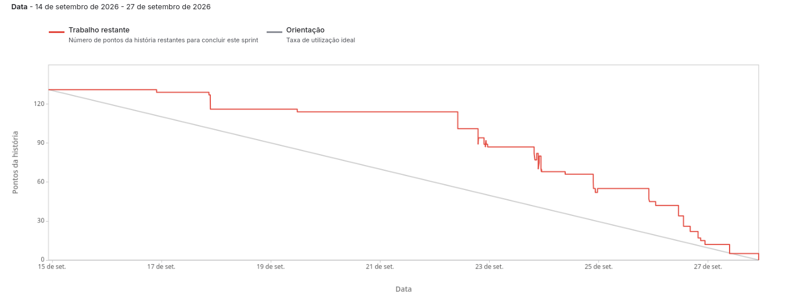

# VariSkill - Sprint 1

 

    <a href="#objetivos"> Objetivos da Sprint </a> &nbsp;|&nbsp;&nbsp;
    <a href="#entregas"> Entregas </a> &nbsp;|&nbsp;&nbsp;
    <a href="#metricas"> Métricas do Time </a> &nbsp;|&nbsp;&nbsp;  
    <a href="#backlog"> Backlog da Sprint </a> &nbsp;|&nbsp;&nbsp;  
    <a href="#links"> Links úteis </a>

---

No início do desenvolvimento da plataforma **VariSkill**, o objetivo principal da Sprint 1 foi assegurar a fundação do sistema: o fluxo de cadastro e autenticação de usuários, o acolhimento interativo via assistente virtual no onboarding, a condução do teste de nivelamento diagnóstico orientativo e a disponibilização dos conteúdos teóricos e atividades práticas com correção determinística e suporte a dicas conceituais via PLN.

# 🎯 Objetivos da Sprint

Os requisitos funcionais atendidos nesta sprint foram:

- ✔️ **RFN01. Cadastro e Perfil:** Cadastro e gerenciamento de dados básicos do usuário e preferências de estudo.
- ✔️ **RFN02. Onboarding e Diagnóstico Orientado:** O assistente conduz a sondagem inicial em linguagem natural para identificar se o usuário é iniciante ou se deseja validar um nível autodeclarado através de uma bateria prática na UI.
- ✔️ **RFN03. Matrícula e Direcionamento de Trilha:** O usuário pode consultar ou ser guiado pelo assistente para se matricular em uma trilha de aprendizagem correspondente ao seu nível.
- ✔️ **RFN04. Execução e Avaliação de Atividades:** A plataforma disponibiliza atividades estruturadas na UI (quiz, desafios) avaliadas por regras determinísticas (sem gasto de IA).
- ✔️ **RFN06. Suporte Contextual durante Atividade:** O assistente tira dúvidas e oferece dicas conceituais sobre a atividade em tela sem entregar a resposta direta.

 

---

# 📲 Entregas

Durante esta sprint, o time entregou artefatos SCRUM validados, como o Backlog do Produto, o Backlog da Sprint e as User Stories com a participação direta da P.O. e alinhamento constante com o cliente. O protótipo visual foi construído e validado no Figma, sendo traduzido em uma aplicação web moderna construída com React 19, TypeScript e Tailwind CSS no front-end, e uma API REST sólida em Django com suporte a busca vetorial `pgvector` no back-end.

### RFN01: Cadastro e Perfil do Usuário
Como usuário, quero me cadastrar e gerenciar meu perfil, para que minhas informações e preferências de estudo fiquem registradas.

### RFN02: Onboarding e Diagnóstico Orientado
Como novo usuário, quero ser acolhido pelo assistente virtual no primeiro login, para que ele apresente as trilhas e entenda meu objetivo inicial.

### RFN03: Matrícula e Direcionamento de Trilha
Como usuário, quero definir com o assistente se farei um teste prático ou se começarei do início, para que minha trilha seja configurada no nível certo.

### RFN04: Execução e Avaliação de Atividades
Como usuário, quero acessar conteúdos conceituais e realizar atividades práticas, para que eu adquira a base teórica e valide meu aprendizado com testes de nível.

### RFN06: Suporte Contextual durante Atividade
Como usuário em atividade, quero consultar o assistente virtual via chat, para que ele tire dúvidas conceituais sem dar a resposta direta.

 

---

# 📈 Métricas do Time

Segue abaixo o acompanhamento de execução e burndown da equipe durante a Sprint 1:

 
    

 

---

# 📃 Backlog da Sprint

| **RFN** | **Rank** | **Prioridade** | **User Story** | **Estimativa** | **Sprint** | **Critérios de Aceitação** |
| ------- | -------- | -------------- | -------------- | -------------- | ---------- | -------------------------- |
| **RFN01** | 1 | Alta | Como usuário, quero me cadastrar e gerenciar meu perfil, para que minhas informações e preferências de estudo fiquem registradas. | 5 | 1 | - Formulário de cadastro com nome, e-mail e senha; - Validação de e-mail único no sistema; - Autenticação segura via tokens JWT; - Edição de perfil para alteração de nome e senha. |
| **RFN02** | 2 | Alta | Como novo usuário, quero ser acolhido pelo assistente virtual no primeiro login, para que ele apresente as trilhas e entenda meu objetivo inicial. | 5 | 1 | - Apresentação amigável do assistente Vari no primeiro acesso; - Listagem interativa das trilhas disponíveis via conversação; - Identificação da trilha escolhida pelo usuário via diálogo. |
| **RFN03** | 3 | Alta | Como usuário, quero definir com o assistente se farei um teste prático ou se começarei do início, para que minha trilha seja configurada no nível certo. | 5 | 1 | - Assistente questiona sobre conhecimento prévio; - Se optar por começar do início, usuário é matriculado no nível básico; - Se declarar nível (ex: intermediário), assistente dispara a bateria de teste prático na UI. |
| **RFN04** | 4 | Alta | Como usuário, quero acessar conteúdos conceituais e realizar atividades práticas, para que eu adquira a base teórica e valide meu aprendizado com testes de nível. | 8 | 1 | - Interface exibe o texto explicativo em Markdown com sintaxe destacada; - Suporte aos 3 formatos de questão (múltipla escolha, lacunas de código e ordenação); - Correção determinística sem custo de IA; - Validação de nota de corte no teste de nível. |
| **RFN06** | 5 | Alta | Como usuário em atividade, quero consultar o assistente virtual via chat, para que ele tire dúvidas conceituais sem dar a resposta direta. | 5 | 1 | - Chat integrado na tela de atividade; - Busca primária na base local de dicas conceituais (`DICA_CONCEITUAL`); - Fallback inteligente com prompt parametrizado caso não haja dica cadastrada; - Tratamento de resiliência e indisponibilidade. |

 

---

# 🔗 Links úteis

- **Tags geradas em cada repositório que simbolizam o fim da 1ª sprint:**  
  - 🔗 [v1.0.0 BACKEND](https://github.com/SkyFlyTeam/Variskill-backend/releases/tag/v1.0.0)  
  - 🔗 [v1.0.0 FRONTEND](https://github.com/SkyFlyTeam/VariSkill-frontend/releases/tag/v1.0.0)
